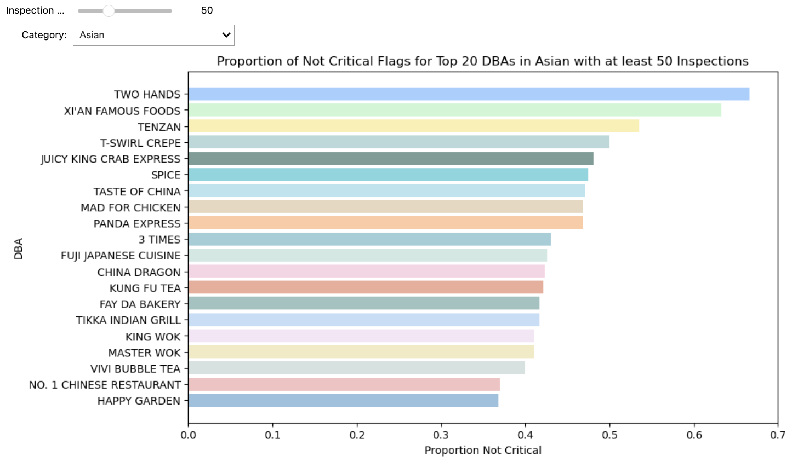

<h2>From Delicious to Dangerous: The Health Violation Crisis in NYC Restaurants</h2>

<b style="text-align: justify; text-justify: inter-word;">
Thinking of dining out in New York City? Picking the perfect spot is more than just about taste—it’s about trust! We’re diving into a dataset describing NYC restaurant inspection results to uncover the connections between location, cuisine, brand, and health violations. Join us on a journey to discover the cleanest kitchens in the city, and make your next meal out a safe and satisfying one!
</b>

Every restaurant in NYC has atleast one visit from the Department of Health and Mental Hygiene (DOHMH) every year depending on the result of the previous inspection. The dataset describes a total of 224.155 inspection results through a 10-year time period from 2015 to 2024. If any violations are present, the inspection reports define them with specific violation codes.. Based on the extent and frequency of these violations, restaurants are given a score and categorized as either in a critical or non-critical state.

Before diving into the historical data, the focus will be on the most recent inspection results. This approach provides a current and relevant guide to the sanitary conditions of NYC restaurants.

<b style="text-align: justify; text-justify: inter-word;">
So, what is the most common violation type in NYC?
</b>

Guided by the latest inspection data, let's begin an in-depth exploration of violation codes. Each code represents a unique type of health violation, carefully categorized into seven distinct groups, as outlined in <a href="#table1">Table 1</a>. These categories cover a spectrum of concerns, spanning from minor issues like improper facility maintenance to more serious matters such as unsanitary cooking conditions or bad staff hygiene.

<figure id="table1" style="width: 100%; display: block; margin-left: -15%;">
    
    <figcaption style="max-width: 100%; margin-left: 15%; text-align: justify;">
        <b>Table 1:</b> Provides definitions of violation groups, along with their counts from the latest inspections and an example of a violation description within each group.
    </figcaption>
</figure>

 

The counts and frequencies of different violation groups vary. Concurrently, <a href="#figure1">Figure 1</a> offers insight into the distribution of violation types in recent inspections in NYC. Notably, Facility Sanitation emerges as the most prevalent violation, followed closely by Pest Control. In contrast, Chemical Safety records the lowest frequency, with only 20 instances recorded- which is still 20 too many.

<figure id="figure1" style="width: 130%; margin-left: -15%; margin-right: -15%; text-align: center;">
  
  <figcaption style="max-width: 100%; margin-left: auto; margin-right: auto; text-align: justify;">
    <b>Figure 1:</b> Line chart illustrating the inspection count for each defined violation group, depending on the selected time period. Below the chart, an interactive range slider graph allows users to select specific data ranges. Additionally, a legend positioned to the right enables users to choose which violation group to display on the chart.
  </figcaption>
</figure>

 

Additionally, the plot illustrates a notable increase in counts since mid-2022 for most violation groups, with the exceptions of Chemical Safety and Food Sourcing and Labeling, whose monthly counts consistently remain around 10 and 40, respectively. The surge around mid-2022 could be attributed to increased investment in inspections or stricter documentation procedures within this dataset. However, it's important to note that while Facility Sanitation appears as the most frequent violation, its frequency doesn't necessarily correlate with its level of criticality. To better understand the urgency of each violation group, critical conditions have been investigated and plotted in  <a href="#figure2">Figure 2</a>.

<figure id="figure2" style="max-width: 100%; display: block; margin: 0 auto;">
    
    <figcaption style="text-align: justify;">
        <b>Figure 2:</b> Stacked Bar Chart displaying the count of inspections dependent of the Violation group. The stacked bars indicated the percentage of the count given the flag critical and not critical.
    </figcaption>
</figure>

 

<a href="#figure2">Figure 2</a> highlights the critical nature of certain violation groups, notably Temperature Control, Staff Hygiene, and Chemical Safety.  Notably, despite its high frequency, Facility Sanitation does not emerge as the most critical violation group, suggesting that it may not be as critical to address compared to other violations.It's noteworthy that while Temperature Control ranks as the third most frequent violation, <a href="#figure2">Figure 2</a> reveals it to be among the most critical. This contrast suggests a nuanced understanding of violation severity beyond mere frequency.

<b style="text-align: justify; text-justify: inter-word;">
Craving thai, burger or Chinese food? Maybe have the cuisine in mind when deciding.
</b>

The type of cuisine may influence the likelihood of certain violations due to different cooking methods and ingredients. Despite these differences, we observed a consistent pattern across all cuisines: approximately 50% of inspections result in a Critical flag, while the remaining 50% receive a Not Critical flag.
<a href="#figure3">Figure 3</a> provides insights into the distribution of violations across various cuisines, uncovering some differences. While there's a consistent flag distribution, variations in violation types across cuisines suggest that specific culinary practices or ingredients may incline kitchens to certain types of violations.

<figure id="figure3" style="width: 130%; margin-left: -15%; margin-right: -15%; text-align: center;">
  
</figure>
<figcaption style="max-width: 100%; margin-left: auto; margin-right: auto; text-align: justify;">
  <b>Figure 3:</b> Pie-charts for the different cuisines showing the distribution of violation codes reported.
</figcaption>

 

<a href="#figure3">Figure 3</a> illustrates a consistent trend in the distribution of violation codes, where Facility Sanitation is the most common violation followed by Pest Control across all kitchens. However, considering the criticality distributions from <a href="#figure2">Figure 2</a>, we observe that cuisines with higher percentages of Temperature Control and Staff Hygiene violations pose a greater risk of being in a critical hygiene condition. Specifically, Asian and Pizza cuisines exhibit notably higher percentages in Temperature Control violations, at 16.8% and 15.6%, respectively. Additionally, Asian cuisine also shows a high percentage in Staff Hygiene violations, along with Hotdogs.

<b style="text-align: justify; text-justify: inter-word;">
DBA
</b>

Now that we understand which cuisines have a higher probability of critical hygiene conditions, it's important to consider whether there's a connection between the inspection results and the type of restaurant being inspected. Are these restaurants part of large chains, or are they unique local establishments?
To explore this connection, <a href="#figure4">Figure 4</a> serves as a practical guide for selecting restaurants, particularly when craving Asian cuisine. It displays the top 20 restaurants that consistently receive a "Not Critical" flag in inspection results. It's worth noting that a restaurant may appear multiple times if it is part of a chain, such as various McDonald's locations in NYC. The "Not Critical Proportion" metric used in this chart indicates the frequency with which these restaurants pass inspections without critical issues, suggesting they uphold higher standards of cleanliness.

<figure id="figure4" style="width: 130%; margin-left: -15%; margin-right: -15%; text-align: center;">
  
  <figcaption style="max-width: 100%; margin-left: auto; margin-right: auto; text-align: justify;">
    <b>Figure 4:</b> A bar plot paired with a related map. The bar plot highlights the safest choices of restaurants to visit based on the proportion of inspection results categorized as not critical. The map displays the locations of these restaurants, serving as a guide for selecting areas to visit. The minimum inspection count can be adjusted based on preferences, whether seeking a restaurant chain with multiple locations or a unique local restaurant
  </figcaption>
</figure>

 

<a href="#figure4">Figure 4</a> reveals a notable pattern: as inspection counts increase, the proportion of "Not Critical" results tends to decrease. This suggests that restaurant chains with multiple locations may struggle more to maintain hygiene standards. Therefore, opting for one of the local shops depicted in the figure would likely be a safer choice when seeking cleaner dining options.

 

<!--
<figure id="figure5" style="max-width: 100%; display: block; margin: 0 auto;">
    
    <figcaption style="text-align: justify;">
        <b>Figure 5:</b> Stacked Bar Chart displaying the count of inspections dependent of the Violation group. The stacked bars indicated the percentage of the count given the flag critical and not critical.
    </figcaption>
</figure>
-->

 

In conclusion, our analysis underscores the importance of considering various factors when dining out in New York City. While certain cuisines, such as restaurants serving Asian food, pizza or hotdogs, may exhibit higher probabilities of critical hygiene conditions, the type of restaurant, whether part of a large chain or a local establishment, also plays a significant role. Our findings suggest that local shops may offer a safer dining experience compared to larger restaurant chains, which often struggle to maintain hygiene standards across multiple locations. Therefore, we advise diners to prioritize local establishments when selecting restaurants, ensuring a safer and more satisfying culinary experience in the city.

[View Our Notebook Here (nbviewer)](https://nbviewer.jupyter.org/github/Thomasstycke/Thomasstycke.github.io/blob/main/FinalProjectFinal.ipynb)

Link to csv file [Here](https://data.cityofnewyork.us/Health/DOHMH-New-York-City-Restaurant-Inspection-Results/43nn-pn8j/about_data) 
Link to geojson file [Here](https://data.cityofnewyork.us/Health/Modified-Zip-Code-Tabulation-Areas-MODZCTA-/pri4-ifjk/about_data)
Link to notebook file [Here](https://github.com/Thomasstycke/Thomasstycke.github.io/blob/main/FinalProjectFinal.ipynb)

<head>
  <title>Contributions</title>
  
</head>
<body>

<h2 style="color: #666666;">Contributions</h2> <!-- Optional: Updated heading color to darker gray -->

<table>
    <tr>
        <th>Contributions</th>
        <th>Thomas</th>
        <th>Anna-Sofie</th>
    </tr>
    <tr>
        <td>Figures</td>
        <td>50%</td>
        <td>50%</td>
    </tr>
    <tr>
        <td>Site</td>
        <td>50%</td>
        <td>50%</td>
    </tr>
    <tr>
        <td>Text</td>
        <td>50%</td>
        <td>50%</td>
    </tr>
</table>

</body>

